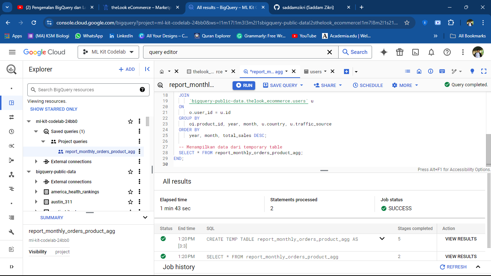

# insignia_DA_intern_test
Report Monthly Orders Product Agg

# Monthly Sales Report by Product

This repository contains an SQL script that generates a temporary table for reporting monthly sales by product. The table helps identify the total orders and sales for each product on a monthly basis.

## SQL Script Overview

The SQL script creates a temporary table named `report_monthly_orders_product_agg`. This table aggregates sales data on a per-product, per-month basis, providing a clear view of which products are performing best each month.

### Query Explanation

- **CREATE TEMP TABLE report_monthly_orders_product_agg:**
  - Creates a temporary table to store the results of the query. This table is temporary and will only exist during the current session.

- **SELECT:**
  - Retrieves essential data like `product_id`, `year`, `month`, `total_orders`, and `total_sales` from the `orders` and `order_items` tables.

- **EXTRACT(YEAR FROM o.created_at) & EXTRACT(MONTH FROM o.created_at):**
  - Extracts the year and month from the order date to group the data by month.

- **COUNT(oi.order_id) & SUM(oi.sale_price):**
  - Counts the total number of orders and sums up the total sales amount for each product within the specified month.

- **JOIN orders and order_items:**
  - Combines data from the `orders` table and the `order_items` table based on the `order_id` to get detailed product information.

- **GROUP BY and ORDER BY:**
  - Groups the data by `product_id`, `year`, and `month` and orders the results to highlight the products with the highest sales each month.

## How to Use

1. Clone this repository.
2. Run the SQL script in your BigQuery environment.
3. The script will create a temporary table that can be used to analyze monthly product sales.

## Conclusion

This temporary table provides valuable insights into monthly sales trends, making it easier to identify top-performing products and track their performance over time.

## Usage Example

This is the preview when using the query in BigQuery environment.

